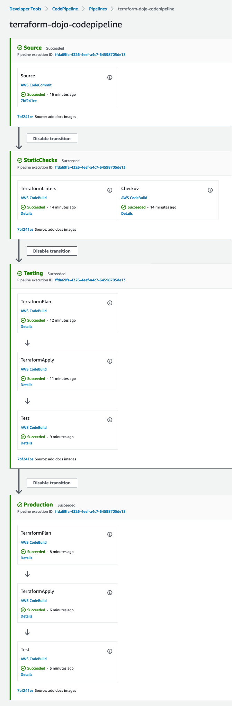
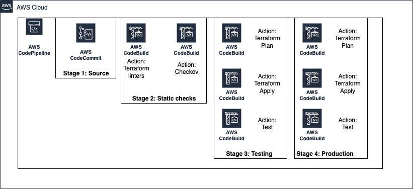
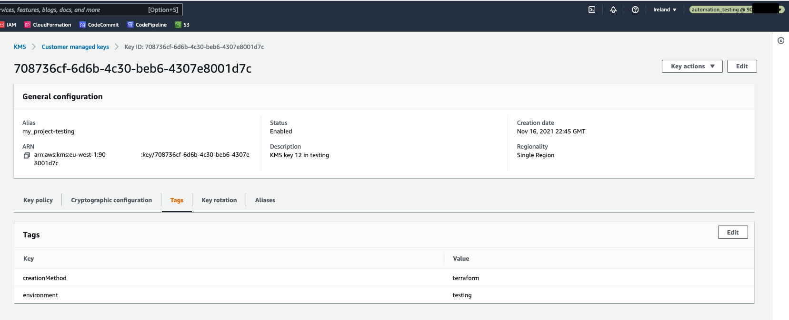
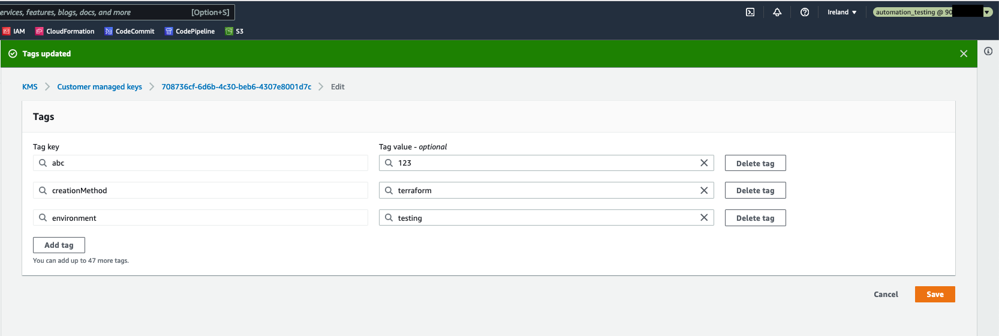
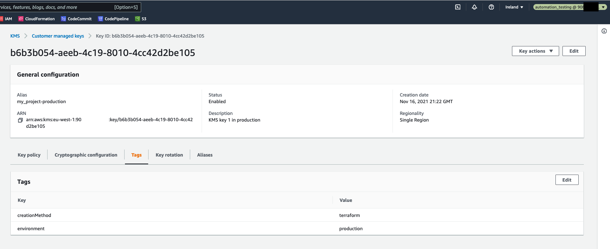
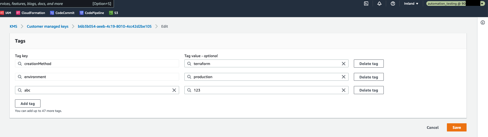
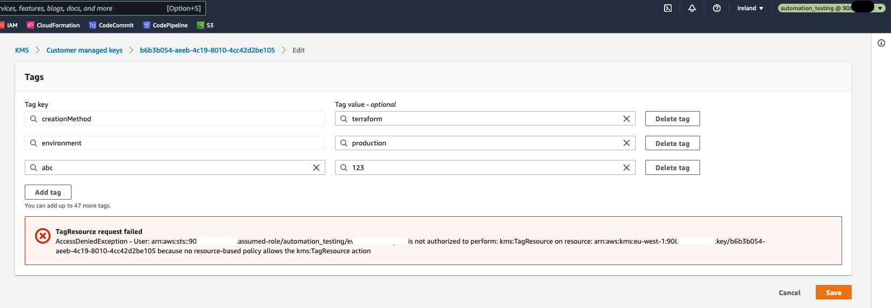
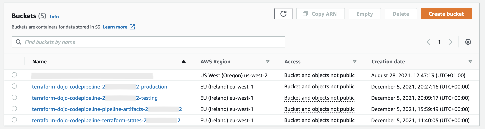
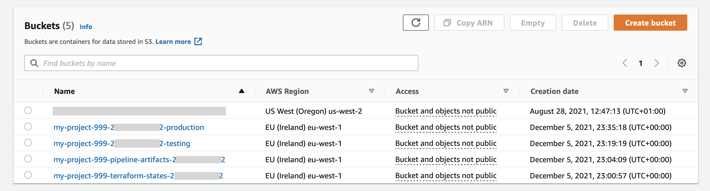

# terraform-dojo-codepipeline

## Aim

This repository provides a pattern to use **HashiCorp Terraform to deploy resources for a workload in a secure fashion, minimising the overhead of starting a new project**.

The solution is designed around users storing Terraform assets within an AWS CodeCommit repository. Commits to this repository will trigger an AWS CodePipeline pipeline which will scan the code for security vulnerabilities, before deploying the project into the AWS account.

The solution supports multiple deployment environments and supports best practices such Infrastructure as Code and static analysis.

The default AWS region is set to `eu-west-1`.

## Benefits

* There is a convention applied for working with Terraform in multiple deployment environments, so you don't need to reinvent the wheel
* Operations are automated
* The same operations are to be performed locally and in a CICD pipeline
* A CICD pipeline is provided, and it can be extended by adding more stages or actions
* Shift left approach for security is applied

## Practices

There are several practices implemented by this solution:
* least privilege principle
* pipelines as code
* environment as code
* Infrastructure as Code
* enforced consistency between local environment and environment provided by CICD
* multiple (2) deployment environments (testing and production)
* security vulnerabilities code scanning
* 1 git repository is used to store all the code and it it treated as a single source of truth

## Limitations
The scope of this solution is **limited to 1 AWS Account**. This means, that all the AWS resources, even though deployed to various environments (testing and production), will be deployed into the same 1 AWS Account. This is not recommended. Instead, a recommendation is to transition to multiple AWS accounts. Please follow [this link](https://docs.aws.amazon.com/whitepapers/latest/organizing-your-aws-environment/single-aws-account.html) for more details.


The solution was tested on Mac OS, using Bash shell. It should also work on Linux.

## Solution details and Git repository structure

### The main infrastructure code - [terraform/](terraform/)
The directory [terraform/](terraform/) contains the main infrastructure code, AWS resources. The workflow of these resources is:
  * first deploy them to a testing environment,
  * then verify that they were deployed correctly in the testing environment,
  * then deploy them to a production environment,
  * then verify that they were deployed correctly in the production environment.

### Terraform backend - [terraform_backend/](terraform_backend/)
In order to use Terraform, [Terraform backend](https://www.terraform.io/docs/language/settings/backends/index.html) must be set up. For this solution the [S3 Terraform backend](https://www.terraform.io/docs/language/settings/backends/s3.html) was chosen. This means that an S3 bucket and a DynamoDB table have to be created. There are many ways of creating these 2 resources. In this solution it was decided to use Terraform with [local backend](https://www.terraform.io/docs/language/settings/backends/local.html) to set up the S3 Terraform backend. The code needed to set up the S3 backend is kept in the [terraform_backend/](terraform_backend/) directory.


### CICD pipeline - [cicd/](cicd/)
In order to be able to use a CICD pipeline to deploy the main infrastructure code, a pipeline has to be defined and deployed. In this solution, AWS CodePipeline and AWS CodeBuild are used to provide the CICD pipeline capabilities. The AWS CodePipeline pipeline and AWS CodeBuild projects are deployed also using Terraform. The Terraform code is kept in the [cicd/](cicd/) directory.

### Documentation
There is also the [docs/](docs/) directory. It contains files which help to document this solution.

### Summary
In summary, there are 3 directories with Terraform files. Thanks to that, deploying this solution:
  * is automated
  * is done in an idempotent way (meaning - you can run this deployment multiple times and expect the same effect)
  * can be reapplied in a case of configuration drift

The process of deploying this solution involves these steps:
1. Set up access to AWS Management Console and to AWS CLI.
2. Create an AWS CodeCommit git repository and upload code to it.
3. Set up Terraform backend (using [terraform_backend/](terraform_backend/) directory).
4. Deploy a CICD pipeline (using [cicd/](cicd/) directory).
5. Deploy the main infrastructure code (using [terraform/](terraform/) directory).
6. Clean up.

## How are the practices implemented?

### Pipelines as code

AWS CodePipeline and AWS CodeBuild are used here. There is 1 pipeline. It covers all the environments. The following stages are provided:
* Source - uses an AWS CodeCommit git repository
* StaticChecks - runs 2 actions (Terraform static checks and Checkov)
* Testing - deploys example AWS resources into the testing environment using terraform plan and terraform apply commands, and then runs a simple test
* Production - deploys example AWS resources into the production environment using terraform plan and terraform apply commands, and then runs a simple test



All the code needed to deploy the pipeline is deployed by Terraform and kept in [cicd/terraform](cicd/terraform) directory. There are also several buildspec files, available in [cicd/](cicd/) directory.

By default, the 2 actions run in the StaticChecks are run sequentially. In order to run them in parallel, please add this line near the top of the [tasks](tasks) file:
```
export TF_VAR_run_tf_static_checks_parallely=true
```

There are separate CodeBuild projects provided for different CodePipeline Actions. But, the same [buildspec file](cicd/buildspec_tf_plan.yml) is used to run `terraform plan` in all the environments. ([AWS docs](https://docs.aws.amazon.com/codebuild/latest/userguide/build-spec-ref.html)).

Both the `tasks` file and the pipeline serve also as documentation about how to operate this solution.

The architecture of the pipeline is presented in the picture below.



#### How to add a pipeline stage or action
1. Add a CodePipeline Stage or Action in [cicd/terraform-pipeline/pipeline.tf](cicd/terraform-pipeline/pipeline.tf)
1. You can either reuse a CodeBuild Project, or add a new one in [cicd/terraform-pipeline/codebuild.tf](cicd/terraform-pipeline/codebuild.tf). Adding a new CodeBuild Project also demands a new buildspec file. Create one in the [cicd/](cicd/) directory.

### Least privilege principle

There are 2 IAM roles provided:
* `automation_testing`
* `automation_production`

The roles are supposed to be assumed by an actor (either a human or CICD server) performing a deployment. The `automation_testing` role is to be assumed when deployment targets the testing environment, and `automation_production` - when the deployment targets production environment.

Both roles provide read only access to the AWS services, by utilizing the [`SecurityAudit`](https://docs.aws.amazon.com/IAM/latest/UserGuide/access_policies_job-functions.html#jf_security-auditor) [AWS Managed Policy](https://docs.aws.amazon.com/IAM/latest/UserGuide/access_policies_managed-vs-inline.html). Furthermore, the `automation_testing` role prevents write access to AWS resources which are tagged as `environment=production`. Similarly, `automation_production` role allows write access to AWS resources tagged as `environment=testing`. This is implemented in the following way:
```
"Condition": {
  "StringNotLike": {
      "aws:ResourceTag/environment": [ "production" ]
  }
}
```
in [cicd/terraform-pipeline/tf_iam_roles.tf](cicd/terraform-pipeline/tf_iam_roles.tf). For more information please read [IAM UserGuide](https://docs.aws.amazon.com/IAM/latest/UserGuide/access_tags.html#access_tags_control-resources)

In result, when the `automation_testing` IAM role is assumed, it is possible to edit an AWS resource which is tagged as `environment=testing`, and it is not possible to edit any AWS resource without this tag. Please see the pictures below.





But, when trying to modify a resource tagged as `environment=production`, there is an error.





### Environment as code and enforced consistency between local environment and environment provided by CICD

Environment as code is provided thanks to Docker and [Dojo](https://github.com/kudulab/dojo). Dojo is a CLI program used to facilitate development in Docker containers. Thanks to this, environment is specified as code. In this solution, there is one configuration file -  [Dojofile](Dojofile) file which specifies the environment needed to run Terraform commands. Dojofile is a Dojo configuration file.

The benefits are:
* the same software versions are used by all the engineers (e.g. Terraform version or AWS CLI version). This fixes the "works for me" problem, where a program works on 1 machine, and does not work on another
* you can use multiple software versions at once without reinstalling them. This is solved by using different Docker images and saving them in Dojofiles.
* the same software versions are used by human engineers and by CICD server

There is also a [tasks](tasks) file used here. It is a Bash script, which provides a programming language switch, and in turn you can run different tasks. It is similar to Makefile/Rakefile, but you don't have to install anything but Bash. Thanks to this, it's possible to run e.g.:
```
./tasks tf_lint
```
and it will create a Docker container and run Terraform static checks inside of that container. The Docker container is orchestrated by Dojo. Dojo takes care of mounting directories, **ensuring container is not run as root**, providing a standard way for development.

You can notice that the same commands are supposed to be run locally on a workstation and the same are invoked in buildspecs, e.g. [buildspec_checkov.yml](cicd/buildspec_checkov.yml). Additional benefit is, that since the commands can be run also locally, it speeds up the development, because you get feedback faster.

There is a convention that states that all the tasks which run in a Docker container, start with a letter, e.g.
```
./tasks tf_lint
```
and all the tasks that run locally, start with an underscore, e.g.
```
./tasks _tf_lint
```
Thanks to that you can choose which way you prefer - running locally or running in a Docker container.

Both the `tasks` file and the pipeline serve also as documentation about how to operate this solution.

---

Furthermore, **Terraform providers versions are pinned**. The versions are set in the `backend.tf` files in each of 3 directories with Terraform code (`terraform_backend`, `cicd`, `terraform`). This follows the [HashiCorp recommendation](https://learn.hashicorp.com/tutorials/terraform/provider-versioning):

> When multiple users or automation tools run the same Terraform configuration, they should all use the same versions of their required providers

### Multiple (2) deployment environments

The main infrastructure code is kept in [terraform/](terraform/) directory. There are 2 environments provided: testing and production. Terraform variables values are set for each environment in an `*.tfvars` file.  There is 1 such file provided for each environment (so there are 2 such files here).

Terraform state is managed in S3. There is 1 S3 bucket, called: `terraform-dojo-codepipeline-terraform-states-${account_id}` and it contains the following state files:
```
terraform-dojo-codepipeline-cicd.tfstate         # CICD pipeline infrastructure state
testing/
  terraform-dojo-codepipeline-testing.tfstate    # State for testing environment
production/
  terraform-dojo-codepipeline-production.tfstate # State for production environment
```

For each of the environments, there is an applicable pipeline Stage. The Stages consist of the same Actions: TerraformPlan, TerraformApply, Test.

The end commands that are supposed to be used in each environment to deploy the infrastructure are:
```
MY_ENVIRONMENT=testing ./tasks tf_plan
MY_ENVIRONMENT=testing ./tasks tf_apply
MY_ENVIRONMENT=production ./tasks tf_plan
MY_ENVIRONMENT=production ./tasks tf_apply
```

Under the hood, the `./tasks tf_plan` task does:
1. assumes the applicable IAM role, either `automation_testing` or `automation_production`
2. runs `dojo` to invoke another task `./tasks _tf_plan`
3. and this task in turn runs:
```
cd terraform/
func_tf_init
terraform plan -out ${project_name}-${MY_ENVIRONMENT}.tfplan -var-file ${MY_ENVIRONMENT}.tfvars
```


Thanks to this, the two environments are orchestrated in the same way, using the same CLI commands. The only difference is the `MY_ENVIRONMENT` environment variable value.

### Security vulnerabilities code scanning

This is provided by [Checkov](https://www.checkov.io/). Please run the following command to invoke the scan:
```
./tasks checkov
```


## Full steps to deploy
### Prerequisites
Please install these first:

* [Bash](https://www.gnu.org/software/bash/)
* [Git](https://git-scm.com/)
* [AWS CLI](https://aws.amazon.com/cli/)
* and
  * either [Terraform](https://www.terraform.io/)
  * or [Docker](https://www.docker.com/) and [Dojo](https://github.com/kudulab/dojo#installation)

### Steps Overview
The process of deploying this solution involves these steps:
1. Set up access to AWS Management Console and to AWS CLI.
2. Create an AWS CodeCommit git repository and upload code to it.
3. Set up Terraform backend (using [terraform_backend/](terraform_backend/) directory).
4. Deploy a CICD pipeline (using [cicd/](cicd/) directory).
5. Deploy the main infrastructure code (using [terraform/](terraform/) directory).
6. Clean up.

### Steps in detail
1. Set up access to AWS Management Console and to AWS CLI.
    * It is assumed that you already have an **AWS Account** and that you can connect to the **AWS Management Console** using for example an IAM Role or an IAM User.
    *  Please ensure that you also have **programmatic access** set up. You may verify this by running the following command:
    ```
    aws s3 ls
    ```
    It should succeed without errors. Please reference [this](https://docs.aws.amazon.com/general/latest/gr/aws-sec-cred-types.html#access-keys-and-secret-access-keys) about programmatic access.
    * Please ensure that you have **enough permissions** set up for your IAM User or IAM Role. You may use for example the AWS Managed IAM Policy - [AdministratorAccess](https://docs.aws.amazon.com/IAM/latest/UserGuide/access_policies_job-functions.html#jf_administrator).
2. Create an AWS CodeCommit git repository and upload code to it.
    1. Clone this git repository using your preferred protocol, such as HTTPS or SSH.
    2. Create an AWS CodeCommit git repository by running:
    ```
    project_name=terraform-dojo-codepipeline
    aws codecommit create-repository --repository-name ${project_name}
    ```
    3. Upload the code from the locally cloned git repository to the AWS CodeCommit git repository. There are multiple options how to do it.
    * It is recommended to use **GRC** (git-remote-codecommit).
      * Please follow [these instructions](https://docs.aws.amazon.com/codecommit/latest/userguide/setting-up-git-remote-codecommit.html) first.
      * Then add a second [Git Remote](https://git-scm.com/book/en/v2/Git-Basics-Working-with-Remotes) to the just cloned repository:
      ```
      project_name=terraform-dojo-codepipeline
      git remote add cc-grc codecommit::eu-west-1://${project_name}
      ```
      * And upload (push) the code to the just added Git Remote by running:
      ```
      git push cc-grc main
      ```
    * If you prefer using **SSH**:
      * Please follow [these instructions](https://docs.aws.amazon.com/codecommit/latest/userguide/setting-up-ssh-unixes.html) first. Ensure that you have SSH key pair available and that you have configured SSH how to connect to AWS CodeCommit.
      * Then add a second [Git Remote](https://git-scm.com/book/en/v2/Git-Basics-Working-with-Remotes) to the just cloned repository:
      ```
      project_name=terraform-dojo-codepipeline
      git remote add cc-ssh ssh://git-codecommit.eu-west-1.amazonaws.com/v1/repos/${project_name}
      ```
      * And upload (push) the code to the just added Git Remote by running:
      ```
      git push cc-ssh main
      ```
3. Set up Terraform backend (using [terraform_backend/](terraform_backend/) directory).
    * Run the following command:
    ```
    ./tasks setup_backend
    ```
    * This step will run `terraform plan` and `terraform apply` commands. If you need to review the `terraform plan` output first, you may want to run the commands manually, please see the [tasks](tasks) file for the specific commands. When running the commands manually, please remember to export the same environment variables as set in the [tasks](tasks) file.
    * This step uses local Terraform backend. The state is saved to the file: `terraform_backend/terraform.tfstate`. You may choose to git commit that file and upload it (push it) to your AWS CodeCommit git repository.
    * This step will create an S3 bucket and a DynamoDB table. This is needed to manage Terraform state remotely. This state will be used for the resources defined in [terraform/](terraform/) and in [cicd/](cicd/) directories.
4. Deploy a CICD pipeline (using [cicd/](cicd/) directory).
    * Please ensure that the above steps were run first.
    * Run the following command:
    ```
    ./tasks setup_cicd
    ```
    * This step will run `terraform plan` and `terraform apply` commands. If you need to review the `terraform plan` output first, you may want to run the commands manually, please see the [tasks](tasks) file for the specific commands. When running the commands manually, please remember to export the same environment variables as set in the [tasks](tasks) file.
    * This step uses the remote S3 Terraform backend. The state is saved in the S3 bucket created in step 3.
    * This step will create an AWS CodePipeline pipeline, together with all the other necessary AWS resources (such as: an S3 bucket for pipeline artifacts, and AWS CodeBuild projects). It will also create the 2 IAM Roles, described under [Least privilege principle](#Least-privilege-principle).
5. Deploy the main infrastructure code (using [terraform/](terraform/) directory).
    * All the steps here are run automatically by a CICD pipeline. You don't need to do anything. The CICD pipeline will be triggered automatically as soon as it was created and also on git push events. You may also trigger the CICD pipeline manually.
    * You may choose to run these commands locally (in addition to them being run already in a CICD pipeline):
    ```
    # Run static checks
    ./tasks tf_lint
    ./tasks checkov

    # Deploy to a testing environment
    MY_ENVIRONMENT=testing ./tasks tf_plan
    MY_ENVIRONMENT=testing ./tasks tf_apply

    # Deploy to a production environment
    MY_ENVIRONMENT=production ./tasks tf_plan
    MY_ENVIRONMENT=production ./tasks tf_apply
    ```
    * The Terraform commands here use the remote S3 Terraform backend. The state is saved in the S3 bucket created in step 3.
    * The Terraform commands here will create some example AWS resources, such as a KMS key, an S3 bucket, a SSM parameter. One set of the resources is created in the testing environment, another set is created in the production environment.
6. Clean up.
    * When you are done with this solution you may want to destroy all resources, so that you do not incur additional costs.
    * Please run the following commands in the given order:
    ```
    MY_ENVIRONMENT=testing ./tasks tf_plan destroy
    MY_ENVIRONMENT=testing ./tasks tf_apply
    MY_ENVIRONMENT=production ./tasks tf_plan destroy
    MY_ENVIRONMENT=production ./tasks tf_apply

    ./tasks setup_cicd destroy
    ./tasks setup_backend destroy
    ```
    * You may want to destroy the CodeCommit git repository too.

### `project_name` variable
Going through the code you may notice that there is the variable `project_name` set. This variable is used as a part of the name of many AWS resources created by this solution, including the CodeCommit git repository. It is used in all 3 directories with Terraform code:
* [terraform_backend/](terraform_backend/)
* [cicd/terraform-pipeline/](cicd/terraform-pipeline/)
* [terraform/](terraform/)

This variable is set in the [tasks](tasks) file. It defaults to "terraform-dojo-codepipeline". The variable value is propagated to Terraform also in the [tasks](tasks) file by running: `export TF_VAR_project_name="terraform-dojo-codepipeline"`.

#### Default value

Using the default value of the `project_name` variable, the following four S3 buckets would be created:
* `terraform-dojo-codepipeline-terraform-states-${account_id}` to keep Terraform state files
* `terraform-dojo-codepipeline-pipeline-artifacts-${account_id}` to keep CodePipeline artifacts
* `terraform-dojo-codepipeline-${account_id}-testing` and `terraform-dojo-codepipeline-${account_id}-production` to serve as example Terraform resources



**S3 buckets are global resources**, and each S3 bucket name must be unique, not only in 1 AWS account, but unique globally. This means, that creating an S3 bucket may fail, if the name is already taken. One approach to overcome this is to **add AWS Account ID into the S3 bucket name**. This approach was applied in this solution.

#### Customising the value

You may want to set this variable to some custom value, e.g. "my-project-999". To change the variable value, please:
* Be aware that only lowercase alphanumeric characters and hyphens will be allowed. This limitation comes from [S3 buckets naming rules](https://docs.aws.amazon.com/AmazonS3/latest/userguide/bucketnamingrules.html).
* Set the variable value in the [tasks](tasks) file. Replace:
```
export project_name="terraform-dojo-codepipeline"
```
with your custom value, e.g.:
```
export project_name="my-project-999"
````
and then git commit and git push that change to a git repository named my-project-999.

This change should be done **before any resources are deployed**.

Setting the custom value for the `project_name` variable to "my-project-999", would lead to creating such S3 buckets:





## Troubleshooting

### How to run more Terraform commands? There is no task with `terraform taint`

#### Problem
This solution provides a Bash script, the [tasks](tasks) file. It is expected that this file will be used to run commands like `terraform plan` and `terraform apply`. But sometimes this is not enough, and there is a need to run more Terraform commands, such as `terraform taint` or `terraform state list`, etc.

#### Solutions
There are multiple alternative solutions here:
1. You may want to add a new task in the [tasks](tasks) file. Then, you can invoke the task in the same way as other tasks.
2. You can invoke the needed commands manually.
  * Start with running `dojo` in the root directory of this git repository. This will create a Docker container and it will also mount the current directory into the Docker container.
  * You may now run the needed commands interactively, in the Docker container.
  * When you are done, just run `exit` and you will exit the Docker container. The container will be removed automatically.

### How to deal with Docker pull rate limit?

#### Problem
This solution uses a public Docker image, [terraform-dojo](https://github.com/kudulab/docker-terraform-dojo), hosted on [DockerHub](https://hub.docker.com/r/kudulab/terraform-dojo). This Docker image is used to run commands locally and also in AWS CodeBuild projects.

When pulling the Docker image, you may experience the following error:
```
docker: Error response from daemon: toomanyrequests:\
  You have reached your pull rate limit. You may increase the limit by\
  authenticating and upgrading: https://www.docker.com/increase-rate-limit
```

#### Solution
This problem occurs, because Docker has recently introduced [Download Rate Limit](https://docs.docker.com/docker-hub/download-rate-limit/). The documentation page informs that: Docker Hub limits the number of Docker image downloads (“pulls”) based on the account type of the user pulling the image.

There are multiple alternative solutions, documented e.g. in [this AWS Blog Post](https://aws.amazon.com/blogs/containers/advice-for-customers-dealing-with-docker-hub-rate-limits-and-a-coming-soon-announcement/):
1. You may want to use [Amazon Elastic Container Registry](https://aws.amazon.com/ecr/) as your Docker images registry. There are 2 options here:
  * you can pull the `terraform-dojo` docker image from DockerHub and push it into Amazon ECR.
  * you can use Amazon ECR as a pull through cache. Please read more [here](https://aws.amazon.com/blogs/aws/announcing-pull-through-cache-repositories-for-amazon-elastic-container-registry/).
2. You may configure CodeBuild to authenticate the layer pulls using your DockerHub account credentials. Please read more [here](https://aws.amazon.com/premiumsupport/knowledge-center/codebuild-docker-pull-image-error/).
3. You may want to have a paid Docker subscription. Please read more [here](https://docs.docker.com/docker-hub/download-rate-limit/#im-being-limited-even-though-i-have-a-paid-docker-subscription).


Dockerfile for terraform-dojo Docker image is available [here](https://github.com/kudulab/docker-terraform-dojo/blob/1.6.0/image/Dockerfile). You can build the Docker image by:
1. Cloning the docker-terraform-dojo git repository.
2. Running this command:
```
./tasks build_local
```

##### Amazon ECR suggestions
If you are using Amazon ECR, you will need to add IAM permissions for CodeBuild to pull Docker images from Amazon ECR. Please add the following into [cicd/terraform-pipeline/codebuild.tf](cicd/terraform-pipeline/codebuild.tf)

```
# Allow CodeBuild to run `aws ecr get-login-password` which is needed
# when CodeBuild needs to pull Docker images from Amazon ECR
resource "aws_iam_role_policy" "codebuild_policy_allow_ecr" {
  name = "${var.project_name}-codebuild-policy-allow-ecr"
  role = aws_iam_role.codebuild_assume_role.id

  policy = <<EOF
{
  "Version": "2012-10-17",
  "Statement": [
    {
      "Effect": "Allow",
      "Resource": [
        "*"
      ],
      "Action": [
        "ecr:GetAuthorizationToken",
        "ecr:BatchGetImage",
        "ecr:GetDownloadUrlForLayer"
      ]
    }
  ]
}
EOF
}
```

You would also have to edit the buildspec files. In each of them, please add 2 lines after the `commands` directive. The example for `buildspec_checkov.yml` would be as following. Please replace `<AWS-Account-ID>` with the AWS Account ID in which you store the ECR Docker image.

```
commands:
  # without the following line, HOME is set to /root and
  # therefore, `docker login` command fails
  - export HOME=/home/codebuild-user
  - aws ecr get-login-password --region eu-west-1 | docker login --username AWS --password-stdin <AWS-Account-ID>.dkr.ecr.eu-west-1.amazonaws.com
  - ./tasks checkov
```

## Ideas to extend this solution
* add support for multiple AWS accounts
* add support to running operations (tasks) on Windows
* add support to using another CICD server, e.g. CircleCI instead of AWS CodePipeline
* add manual approval stage in Production Stage of the pipeline
* add more tests, using some test framework
* add additional action in the pipeline stages: testing and production to check that running `terraform plan` after `terraform apply` was already finished would not try show any changes. The expected output from `terraform plan` would contain the "No changes" string, like in the picture below:


## References
* https://github.com/kudulab/dojo - Dojo
* https://github.com/slalompdx/terraform-aws-codecommit-cicd/blob/v0.1.3/main.tf
https://github.com/aws/aws-codebuild-docker-images/blob/master/ubuntu/standard/5.0/Dockerfile - CodeBuild supported Docker images
* https://docs.aws.amazon.com/codepipeline/latest/userguide/concepts-devops-example.html - example CodePipeline pipeline
* https://aws.amazon.com/premiumsupport/knowledge-center/codebuild-temporary-credentials-docker/ - how to run Docker containers in CodeBuild
* https://docs.aws.amazon.com/IAM/latest/UserGuide/access_policies_managed-vs-inline.html - IAM
* https://docs.aws.amazon.com/IAM/latest/UserGuide/access_tags.html#access_tags_control-resources - IAM
* https://aws.amazon.com/blogs/developer/build-infrastructure-ci-for-terraform-code-leveraging-aws-developer-tools-and-terratest/ - AWS Blog post with example usage of Terratest framework to test Terraform resources
* https://aws.amazon.com/blogs/devops/adding-custom-logic-to-aws-codepipeline-with-aws-lambda-and-amazon-cloudwatch-events/ - AWS Blog post explaining, among others, how to trigger a CodePipeline pipeline on git commit changes while also avoid triggering the pipeline on commits that change only the `readme.md` file
* https://docs.aws.amazon.com/general/latest/gr/aws-sec-cred-types.html#access-keys-and-secret-access-keys - Programmatic access to an AWS Account


## Security

See [CONTRIBUTING](CONTRIBUTING.md#security-issue-notifications) for more information.

## License

This library is licensed under the MIT-0 License. See the LICENSE file.
